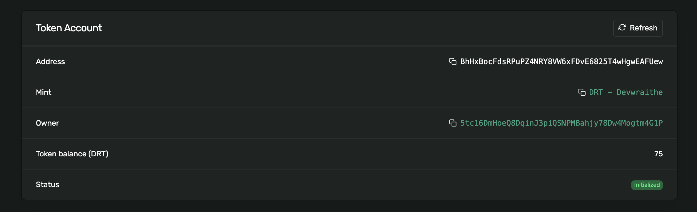

# Aegis Vault

**A secure vault for storing DRT tokens on Solana.**

Aegis is a token vault system on Solana Devnet that stores DRT tokens towards a target amount. Named after the protective shield of Zeus, Aegis provides a secure way to manage and track token deposits.

## Tokens Locked Screenshot and Hash




**Token Address:** [`Fdw8FEek786AZhg4PSSm7nsgHCCu3MsorVhXgMeWZY9a`](https://explorer.solana.com/address/Fdw8FEek786AZhg4PSSm7nsgHCCu3MsorVhXgMeWZY9a?cluster=devnet)

> **Tokens Deposit Transaction Hash**:  
> `3NUKhXJggfJf8UyFwDkKNNWqjzZsbHYd5LxC1ABKM8d78vaa5t3KfXXadpgT1gNrjLsa7okF48vvmEw9LZcNNK7e`

[View Vault Token Account on Solana Explorer](https://explorer.solana.com/address/BhHxBocFdsRPuPZ4NRY8VW6xFDvE6825T4wHgwEAFUew?cluster=devnet)

- **Deployment Signature:** [`2SpHtPZZpX9HytKvnNuMzPxRQFLFiFpB2pLaH5Hz4CunKLqcufg7vS917AxYKapYBM73SVbNZb8C1MmP1uj3zj4o`](https://explorer.solana.com/tx/2SpHtPZZpX9HytKvnNuMzPxRQFLFiFpB2pLaH5Hz4CunKLqcufg7vS917AxYKapYBM73SVbNZb8C1MmP1uj3zj4o?cluster=devnet)
- **Vault Init Signaure:** [`56k8YgtbEG51Smy74DN6mEdvXqa7sXEsyT8K2ZeaYHDiBZ2a1dzwuqKqUE85KF9uhX1tmPBzc7aNtZbTicQMvKiH`](https://explorer.solana.com/tx/56k8YgtbEG51Smy74DN6mEdvXqa7sXEsyT8K2ZeaYHDiBZ2a1dzwuqKqUE85KF9uhX1tmPBzc7aNtZbTicQMvKiH?cluster=devnet)
- **Tokens Deposit Signature:** [`3NUKhXJggfJf8UyFwDkKNNWqjzZsbHYd5LxC1ABKM8d78vaa5t3KfXXadpgT1gNrjLsa7okF48vvmEw9LZcNNK7e`](https://explorer.solana.com/tx/3NUKhXJggfJf8UyFwDkKNNWqjzZsbHYd5LxC1ABKM8d78vaa5t3KfXXadpgT1gNrjLsa7okF48vvmEw9LZcNNK7e?cluster=devnet)

## Setup and Usage

1. Clone and install dependencies:

```bash
git clone https://github.com/devwraithe/aegis.git
cd aegis
yarn install
```

2. Run the escrow program:

```bash
yarn execute
```

## Tests

```bash
anchor test
```

## Deployment

Ensure your environment is configured for Devnet in Anchor.toml:

```toml
[programs.devnet]
themis = "<YOUR_PROGRAM_ID>"

[provider]
cluster = "devnet"
wallet = "~/.config/solana/id.json"
```

> Ensure your local or devnet wallet is funded (via airdrop or manual transfer) before running any transactions.

Set Solana CLI to devnet and deploy the program:

```bash
solana config set --url devnet
anchor deploy
```

**Note:** Minting requires the `mint_authority.json` file which is not included in the repository. Running the command above will auto-create a `user_keypair.json` file for you.

## Security

⚠️ **Never commit your `mint_authority.json` and `user_keypair.json` files or share their private keys.**

---

_In cryptography we trust, in Aegis we protect._
